# SlowReader: Graph-Augmented Reading Assistant

SlowReader is an intelligent **hybrid RAG (Retrieval-Augmented Generation)** application designed to help users read, understand, and organize complex technical documents. It combines **Streamlit**, **Neo4j**, and **Ollama** to extract semantic triplets, build knowledge graphs, and generate precise context-aware responses.

---

##  Components

- **Frontend interface:** [Streamlit](https://streamlit.io/)
- **Graph Database:** [Neo4j](https://neo4j.com/)
- **LLM Provider:** [Ollama](https://ollama.com/) (Local Llama 3.1)
- **LLM Model:** llama3.1:8b
- **Embeddings:** mxbai-embed-large
- **MCP Server:** [mcp-neo4j-cypher](https://github.com/neo4j-contrib/mcp-neo4j/tree/main/servers/mcp-neo4j-cypher) 

---

## User Flow

This guide describes how to set up and run the **SlowReader Hybrid RAG App** locally.


### 1️⃣ Install Ollama and Models

Install [Ollama](https://ollama.com/) and pull the required models:

```bash
ollama pull llama3.1:8b
ollama pull mxbai-embed-large
```

---

### 2️⃣ Install Docker

Install [Docker Desktop](https://www.docker.com/) for your operating system.

---

### 3️⃣ Clone this Repository

```bash
git clone https://github.com/OlenaShev4nko/SlowReader.git
cd SlowReader
```
This will create a local copy of the SlowReader app on your machine, ready for setup and configuration.

---

### 4️⃣ Create a `.env` File

At the project root, create a file named `.env` and add the following configuration:

```dotenv
# Ollama configuration
OLLAMA_HOST=http://host.docker.internal:11434
EMBEDDINGS_MODEL=mxbai-embed-large
CHAT_MODEL=llama3.1:8b

# Neo4j + MCP configuration
NEO4J_MCP_URL=http://neo4j_mcp:8080/api/mcp/
NEO4J_URI=bolt://neo4j:7687
NEO4J_USERNAME=neo4j
NEO4J_PASSWORD=LetsNeo4j
```

---

### 5️⃣ Set Up Environment

```bash
python -m venv .venv
source .venv/bin/activate
pip install -r requirements.txt
pytest tests/unit -q
```

### 6️⃣ Run the Application

```bash
docker-compose up -d --build
pytest -m integration -v
```

✅ You should see:
- Streamlit app imports fine
- Ollama chat + embeddings endpoints work
- Neo4j is reachable
- MCP (microservice) is responding

If all tests pass, your environment is ready.

### 7️⃣ Access Interfaces

- **Streamlit App:** [http://localhost:8501/](http://localhost:8501/)
- **Neo4j Browser:** [http://localhost:7474/browser/](http://localhost:7474/browser/)

To stop everything:
```bash
docker-compose down
deactivate
```

### 8️⃣ Clean or Reset Neo4j Database

If you want to erase all data and start with a clean graph, open the Neo4j Browser at http://localhost:7474/browser/ and execute the following Cypher commands:

```sypher
// Delete all nodes and relationships
MATCH (n)
DETACH DELETE n;

// Show all existing indexes
SHOW INDEXES;

// Drop the vector index if it exists
DROP INDEX chunk_embeddings IF EXISTS;
```
This will:

- Remove all nodes (Documents, Chunks, Concepts, etc.)
- Remove relationships between them
- Drop the vector index used for embeddings (chunk_embeddings)

You can now re-upload PDFs or re-ingest data from scratch.

---

## Screenshots & Workflow

This is the helicopter view architecture of the app, consisting of a Streamlit user interface, local Ollamma chat and embedding models, an MCP server, and a Neo4j graph database.

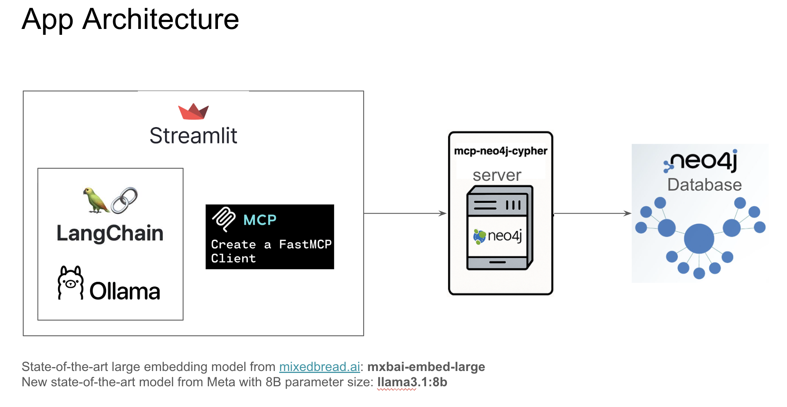


---

The app has four tabs: 
- Tab 1: The PDF document upload, 
- Tab 2: The knowledge graph builder
- Tab 3: Hybrid RAG
- Tab 4: Library

### Tab 1 — Upload a PDF

Imagine you are reading a technical book and plan to take notes from it. We can upload it to the app.

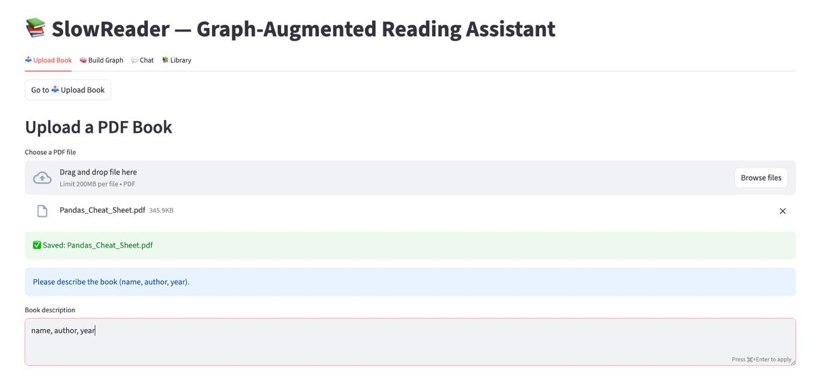

The moment we upload the book, the app extracts the text from the PDF, divides it into chunks, and makes an embedding vector from each chunk. Then, through the MCP server, we are asking the Neo4j database to create a document node for the book, a node for each chunk, and add chunk embeddings into the Neo4j vector index.

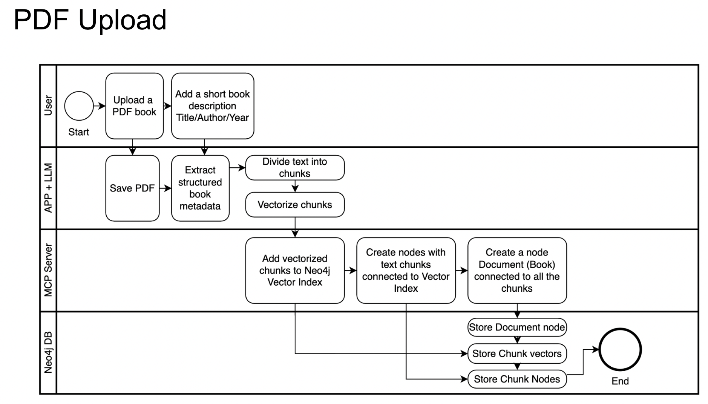

Let’s check the database. Here is our book and its chunks.

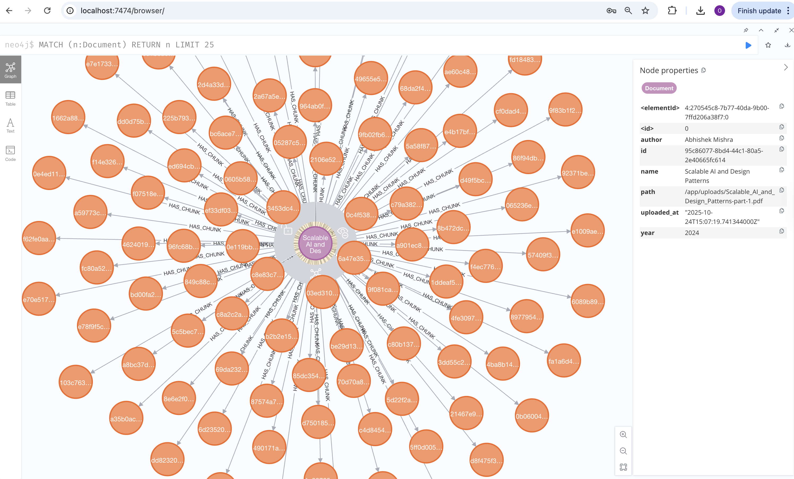

---

### Tab 2 — Build Knowledge Graph

Imagine you’ve found a valuable piece of text with a code example and you want to make a note of it. You can copy and paste this text with a code and push the build graph button.

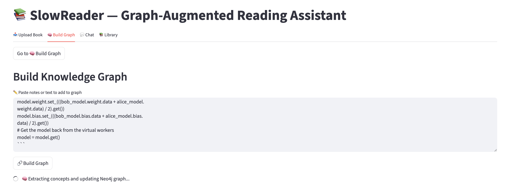
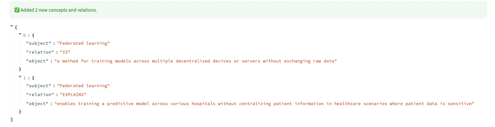

At the exact moment the build graph button is pressed, the LLM extracts triplets of concepts and their connections. With the help of MCP, we are merging them into our graph. Additionally, we vectorize each concept and search for semantically related text chunks to link them together.

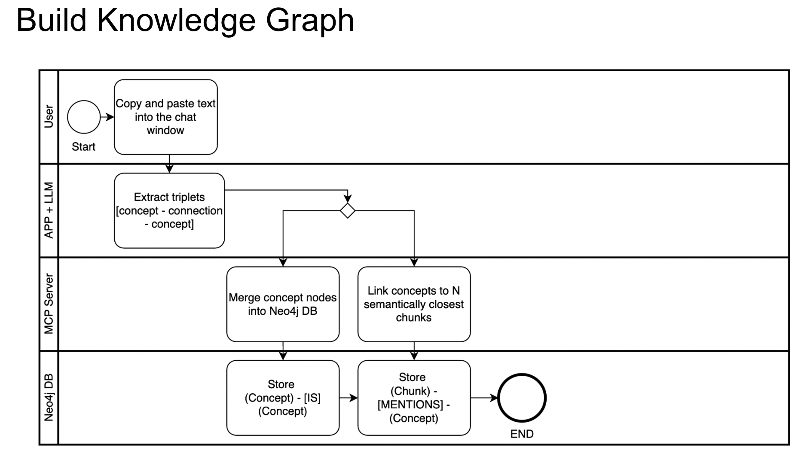

Please note that the concept stores a code example as a property.

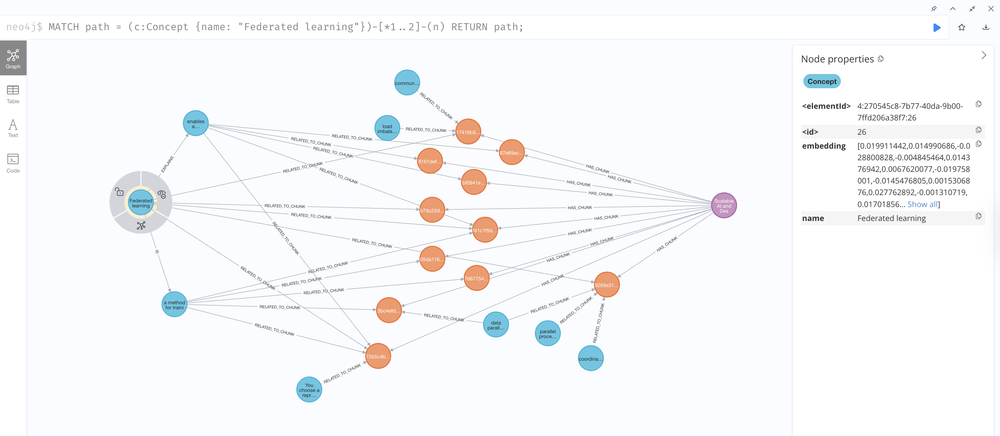


---

### Tab 3 — Chat with Hybrid RAG

Now we can ask our chat LLM about the concepts we have in our database.

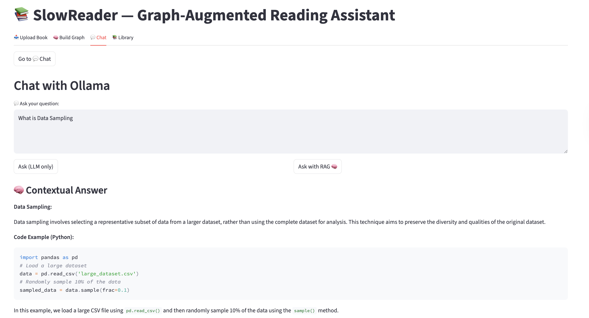
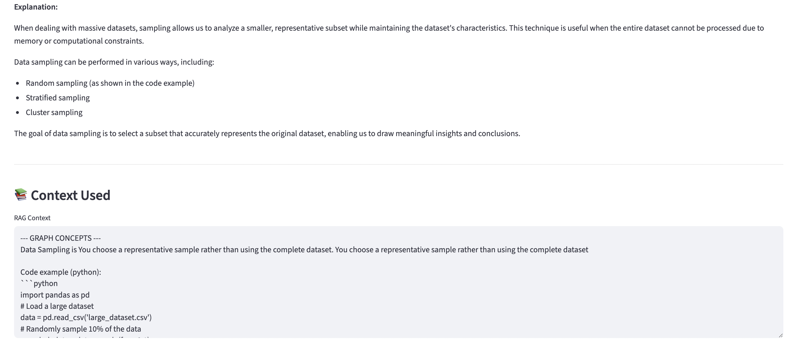

When a user asks a question, the hybrid RAG process starts. First, we extract key concepts from the question and search for them in our graph database. At the same time, we convert the question into an embedding vector and use it to find semantically similar text chunks in the vector index. This way, we bring together structured knowledge from the graph and contextual meaning from the text. Both sources are then combined and passed to the LLM as context, allowing it to generate an accurate and well-grounded response.

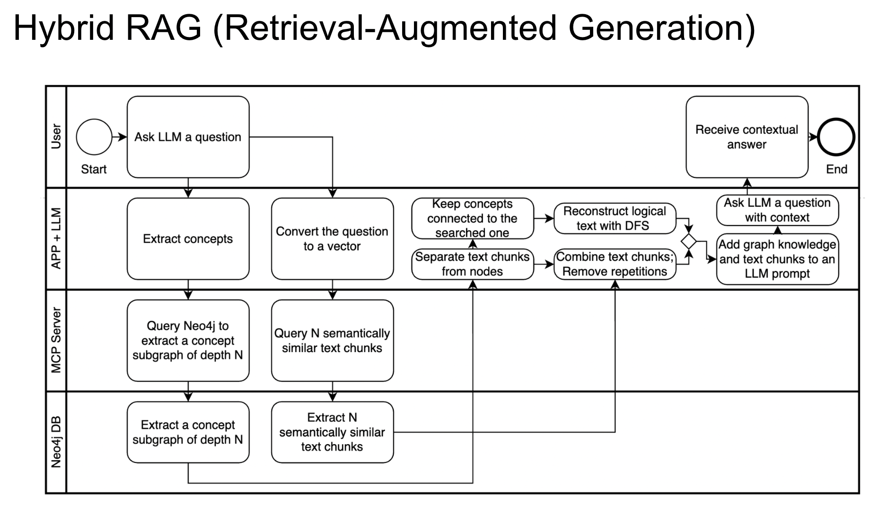


---

### Tab 4 — Library & Saved Documents

In the library tab, we can confirm the book is uploaded.

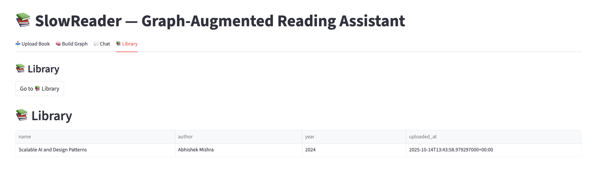

---

## 🪪 License

This project is licensed under the **Apache 2.0 License**. See the [LICENSE](LICENSE) file for details.

---


## Acknowledgements

This project builds upon the excellent [mcp-neo4j-cypher](https://github.com/neo4j-contrib/mcp-neo4j/tree/main/servers/mcp-neo4j-cypher)
server by the Neo4j Contrib community (Apache 2.0 License).

The current version has been extended and adapted by **Olena Shevchenko (2025)**  
to include additional MCP tools for hybrid RAG and local embedding workflows:
Added three custom MCP tools: link_concept_chunks, search_chunks_by_embedding, get_concept_subgraph